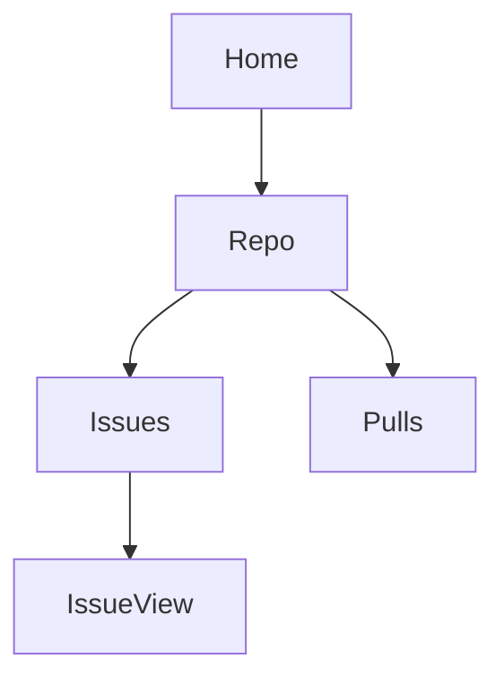

# web2skill (`w2s`)

Turn any website into a reusable AI agent skill.

`w2s` is a **skill that makes skills**. Load it into your AI coding agent (Claude Code, Codex, Cursor, etc.), point it at a website, and it produces a structured `SKILL.md` file that any agent can read to navigate that website like a human would.

```
You:  "Compile github.com for issue management"
Agent:  *uses w2s* → outputs a github.com skill

You:  "Close issue #42 on foo/bar"
Agent:  *reads the github.com skill* → navigates and closes it
```

That's the whole idea.

---

## Why this exists

Today, asking an AI agent to do something on a website means the agent has to:

1. Open the website
2. Look at thousands of DOM elements
3. Figure out which one is the right button
4. Click it
5. Repeat for every step

That's slow, expensive (lots of LLM tokens), and flaky (the agent gets confused by noise).

`w2s` flips this. The expensive work — figuring out where everything is on a website — happens **once**, when you compile the site. The result is a `SKILL.md` file: a compact, structured instruction manual the agent reads in seconds. After that, every interaction with that website is fast, cheap, and reliable.

---

## Who is this for?

- **Anyone** who wants their AI agent to do things on a specific website
- **Developers** building agents that need to interact with web apps
- **Teams** that want consistent, shareable automation across tools and team members

You don't need to write code. You don't need to understand selectors or DOMs. You point, w2s compiles, your agent gets a new skill.

---

## How it works

`w2s` is itself a skill — a folder of files that an agent loads. The folder contains:

```
w2s/
├── SKILL.md              ← the entry point the agent reads first
├── format-spec.md        ← exact schema for output skills
├── distillation.md       ← how to extract a compact page map
├── route-grouping.md     ← how to group URLs into route families
└── examples/             ← worked examples
```

When you ask your agent to compile a website, the agent:

1. **Distills** each URL into a compact map of the page (interactive elements, layout, modals — no scripts, no styles, no noise)
2. **Groups** URLs that share a structure into route families (e.g., all `/owner/repo` pages)
3. **Writes** a `SKILL.md` per route family, containing the page architecture, element inventory, workflows, and edge cases
4. **Writes** an `overview.md` with a site map showing how routes connect
5. **Saves** everything to the agent's skills directory

The output looks like this:

```
~/.claude/skills/
└── github.com/
    ├── overview.md       ← site map + route index
    ├── repo.md           ← instructions for /:owner/:repo
    ├── issues.md         ← instructions for /:owner/:repo/issues
    └── ...
```

---

## Installation

`w2s` is just a folder of markdown files. There is nothing to install.

### Claude Code

```bash
git clone https://github.com/your-org/w2s.git
mkdir -p ~/.claude/skills
cp -r w2s ~/.claude/skills/web2skill
```

Restart Claude Code. The `web2skill` skill is now available.

### Codex / Cursor / other agents

Each agent has its own skills directory. Copy `w2s/` into that directory using the agent's documentation. The format is intentionally portable.

### Custom location

You can also keep w2s anywhere and point your agent at it. The skill is self-contained.

---

## Usage

Once installed, just ask your agent:

```
Compile https://github.com/foo/bar and https://github.com/foo/bar/issues 
into a skill.
```

```
Use w2s to make a skill for managing Linear issues.
```

```
Turn https://app.notion.so into a skill so I can create pages.
```

The agent will:

1. Ask for the URLs you want compiled (if you didn't provide them)
2. Visit each URL
3. Generate the skill files
4. Save them to the skills directory
5. Tell you the skill is ready

After that, you can use the compiled skill directly:

```
Star the web2skill repo on GitHub.
```

The agent will read the github.com skill and know exactly where to click.

---

## The skill format

Every skill that w2s produces follows the same structure. This is what makes skills **portable across agents** — any agent that can read markdown with YAML frontmatter can use them.

### `overview.md` — the site map

```markdown
---
name: github
domain: github.com
description: |
  Use github.com to navigate repositories, manage issues and PRs, 
  review code, star/watch repos, and configure settings.
match:
  - github.com
  - github.com/*
---

# GitHub — Site Map

## Route map


## Sub-skills
- `repo.md` — matches /:owner/:repo
- `issues.md` — matches /:owner/:repo/issues/*
- `pulls.md` — matches /:owner/:repo/pull/*

## Site-wide patterns
- Header: logo top-left, search top-center, avatar top-right
- Auth: "Sign in" link at top-right when logged out
```

### `issues.md` — a single route

```markdown
---
name: github-issues
description: |
  Read, filter, create, and close issues on a GitHub repository.
match:
  - /^https:\/\/github\.com\/[^/]+\/[^/]+\/issues(\/.*)?$/
requires:
  - github
---

# GitHub — Issues Page

## Page architecture
- Sub-header: repo name + Issues/Pull requests toggle
- Left rail: filters (Open/Closed, Labels, Milestones, Assignees)
- Main column: list of issues, each with title, number, author, labels

## Element inventory

### `new-issue-btn`
- type: button
- selector: `a[href$="/issues/new"]`
- fallback: text="New issue"
- location: top-right of main column, green

### `issue-row` (repeatable)
- type: list item
- selector: `[data-testid="issue-row"]`
- contains:
  - `issue-title` (link)
  - `issue-number` (text, e.g. "#1234")
  - `issue-labels` (list)

## Workflows

### Create a new issue
1. Confirm on route /owner/repo/issues
2. Click `new-issue-btn`
3. Fill in title (input labeled "Title")
4. Fill in body (textarea labeled "Leave a comment")
5. Click "Submit new issue"

## Edge cases
- Empty state: "No issues" with "New issue" CTA
- Auth wall: "Sign in" link at top-right when logged out
```

---

## What w2s does NOT do (yet)

- **Self-healing broken skills** — if a site changes, the skill may break; you re-compile
- **Compile behind authentication automatically** — you need to be logged in during compile
- **Handle every edge case of every site** — w2s is best for sites with stable, semantic HTML

---

## Running the skills you compile

Compiling a skill produces a folder of markdown files. To actually **run** them (have an agent follow the workflows against a live browser), you need a browser-use client. The recommended one is [browser-use](https://github.com/browser-use/browser-use) — open source, Python, headed mode by default, supports a custom system prompt.

See [`docs/integrations/browser-use.md`](./docs/integrations/browser-use.md) for the full guide. The minimum:

```python
import asyncio
from pathlib import Path
from browser_use import Agent
from langchain_openai import ChatOpenAI

async def main():
    skill = Path("~/.claude/skills/github.com").expanduser().read_text()
    agent = Agent(
        task="Star the web2skill repo on GitHub",
        llm=ChatOpenAI(model="gpt-4o"),
        extend_system_message=skill,
    )
    result = await agent.run()
    print(result)

asyncio.run(main())
```

Other integrations (Stagehand, raw Playwright, Anthropic Computer Use) are also possible — w2s skills are just markdown, so any agent that can read a system prompt can use them.

---

## Project status

This is the design and initial implementation. The skill format and methodology are stable. The agent integrations are being validated across Claude Code, Codex, and Cursor.

---

## Contributing

Skills are the most valuable contribution. If you compile a skill for a useful site, share it. If you find a flaw in the format or methodology, open an issue.

---

## License

TBD
