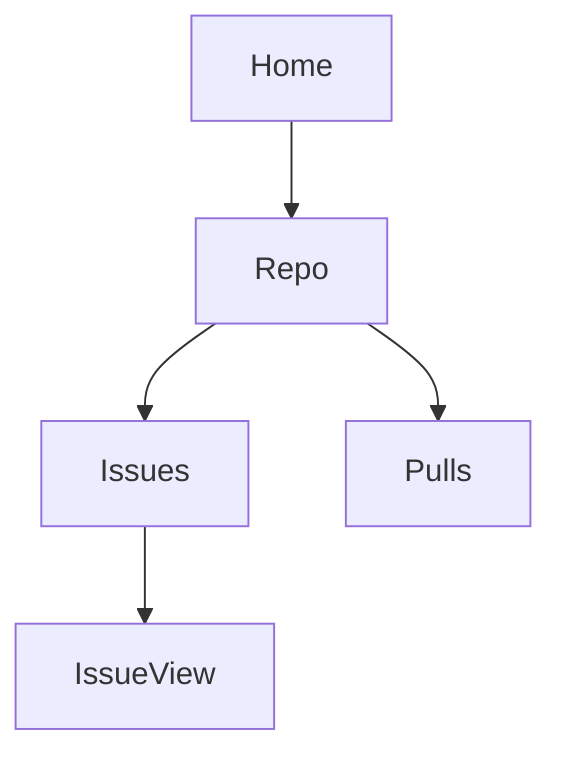

# web2skill (`w2s`)

**Turn any website into a comprehensive page reference for AI agents.**

`w2s` is a skill that produces skills. Load it into your AI coding
agent (Claude Code, Codex, Cursor, etc.), point it at a website,
and it produces a structured folder of `SKILL.md` files that
documents every element, every state, every form, and every edge
case of the site.

```
You:   "Compile github.com"
Agent: *uses w2s* → produces a github.com page reference

You:   (later) "I want to close issue #42"
Agent: *reads the github.com reference* → knows exactly where the
       close button is, what state the page is in, what could go
       wrong
```

The output is a **reference**, not a recipe. Workflow generation
is a separate downstream project that reads this reference.

---

## One-prompt setup

Don't want to do this manually? Give this prompt to your agent — it will set everything up for you:

```
You are setting up web2skill (w2s), a skill that turns websites into
agent-readable skills. Your job: clone the repo, install it into your
skills directory, verify it loads, and report.

Steps:
1. Clone the repo to ~/web2skill (or `git pull` if it exists).
2. Detect your skills directory. Common locations:
   - Claude Code: ~/.claude/skills/
   - Codex: ~/.codex/skills/
   - Cursor: ask the user or check ~/.cursor/skills/
   - Other: search for an existing skills/ directory or ask the user.
3. Copy ~/web2skill/w2s into your skills directory as `web2skill/`.
4. Verify by reading ~/.claude/skills/web2skill/SKILL.md (or your
   agent's path) — first line should be `---`.
5. Report:
   - Install path
   - Validator path: ~/web2skill/w2s/validate.py
   - First command to try: "Compile https://github.com/foo/bar into a skill."

Do not modify the repo. Do not run the validator yet. Just install and
report.
```

After setup, ask your agent: **"Compile https://github.com/foo/bar into a skill."**

What it does: detects your platform, clones the repo, copies the skill into your agent, verifies the install, and reports. To run compiled skills, see [Running compiled skills](#running-compiled-skills) below.

---

## Table of contents

- [One-prompt setup](#one-prompt-setup)
- [Why this exists](#why-this-exists)
- [Quick start](#quick-start)
- [How it works](#how-it-works)
- [Installation](#installation)
- [Usage](#usage)
- [The reference format](#the-reference-format)
- [Using the compiled reference](#using-the-compiled-reference)
- [Compiling with agent-browser](#compiling-with-agent-browser)
- [Examples](#examples)
- [Project structure](#project-structure)
- [What's next: workflow generation](#whats-next-workflow-generation)
- [What w2s does NOT do](#what-w2s-does-not-do)
- [Contributing](#contributing)
- [License](#license)

---

## Why this exists

Today, asking an AI agent to do something on a website means the agent has to:

1. Open the website
2. Look at thousands of DOM elements
3. Figure out which one is the right button
4. Click it
5. Repeat for every step

That's slow, expensive (lots of LLM tokens), and flaky (the agent gets confused by noise).

`w2s` flips this. The expensive work — figuring out where everything is on a website — happens **once**, when you compile the site. The result is a folder of `SKILL.md` files: comprehensive references that document every element, every state, every form, and every edge case. The agent reads the reference once and knows exactly what the page offers.

### Who is this for?

- **Anyone** who wants their AI agent to do things on a specific website
- **Developers** building agents that need to interact with web apps
- **Teams** that want consistent, shareable automation across tools and team members

You don't need to write code. You don't need to understand selectors or DOMs. You point, w2s compiles, your agent gets a new skill.

---

## Quick start

The fastest path from zero to a working compiled skill.

### 1. Install w2s into your agent

```bash
git clone https://github.com/rishi-ie/web2skill.git
mkdir -p ~/.claude/skills
cp -r web2skill/w2s ~/.claude/skills/web2skill
```

Restart Claude Code. The `web2skill` skill is now available.

### 2. Compile a website

Ask your agent:

```
Compile https://github.com/foo/bar and https://github.com/foo/bar/issues
into a reference.
```

The agent will visit the URLs, click every interactive element,
document everything, and save the reference to
`~/.claude/skills/github.com/`.

### 3. Use the reference

Pass the reference as context to any LLM agent:

```
Read ~/.claude/skills/github.com/ and star the web2skill repo.
```

The agent reads the reference, looks up the star button's
selector in the element inventory, and uses it.

```python
import asyncio
from pathlib import Path
from browser_use import Agent
from langchain_openai import ChatOpenAI

async def main():
    ref = Path("~/.claude/skills/github.com").expanduser().read_text()
    agent = Agent(
        task="Star the web2skill repo on GitHub",
        llm=ChatOpenAI(model="gpt-4o"),
        extend_system_message=ref,
    )
    result = await agent.run()
    print(result)

asyncio.run(main())
```

A real Chrome window opens and you can watch the agent work.

---

## How it works

`w2s` is itself a skill — a folder of files that an agent loads.

```
w2s/
├── SKILL.md              ← the entry point the agent reads first
├── format-spec.md        ← exact schema for output references
├── distillation.md       ← how to extract a comprehensive page map
├── route-grouping.md     ← how to group URLs into route families
├── validate.py           ← lint a compiled reference against the format spec
└── examples/             ← worked examples
    ├── simple-static-site/
    ├── complex-spa/
    └── web2skill-agent-browser/
```

When you ask your agent to compile a website, the agent follows a 7-step methodology:

1. **Extract the URL list** — parse the user's request into URLs
2. **Distill each URL** — observe the page in its initial state AND click every interactive element to trigger modals, dropdowns, hover-revealed actions, etc. (excluding destructive buttons)
3. **Group URLs into route families** — URLs that share a structure share a file
4. **Write one `SKILL.md` per route family** — comprehensive reference: page architecture, element inventory, forms, states, edge cases
5. **Write the `overview.md`** — site map, route index, site-wide patterns
6. **Save the reference** — to the agent's skills directory
7. **Self-check** — verify every ref in prose exists in the element inventory, every match pattern is real, selectors are stable, no destructive element was clicked

The output looks like this:

```
~/.claude/skills/
└── github.com/
    ├── overview.md       ← site map + route index
    ├── repo.md           ← comprehensive reference for /:owner/:repo
    ├── issues.md         ← comprehensive reference for /:owner/:repo/issues
    └── ...
```

Each per-route file is a **reference**, not a workflow. The
downstream workflow generator reads these references and decides
what to do at runtime. w2s's job ends at "document what the page
offers."

---

## Installation

`w2s` is just a folder of markdown files. There is nothing to install beyond copying them into your agent's skills directory.

### Claude Code

```bash
git clone https://github.com/rishi-ie/web2skill.git
mkdir -p ~/.claude/skills
cp -r web2skill/w2s ~/.claude/skills/web2skill
```

Restart Claude Code. The `web2skill` skill is now available — you should see it listed when you ask Claude what skills it has.

### Codex

Codex CLI looks for skills in `~/.codex/skills/`:

```bash
git clone https://github.com/rishi-ie/web2skill.git
mkdir -p ~/.codex/skills
cp -r web2skill/w2s ~/.codex/skills/web2skill
```

### Cursor

Cursor reads skills from a project-local or global location depending on your setup. Place `w2s/` wherever Cursor expects to find Agent Skills. See [Cursor's skills documentation](https://docs.cursor.com) for the current path.

### Other agents

Any agent that supports the Agent Skills format (YAML frontmatter + markdown body) can use w2s. The skill is intentionally portable. If your agent has a skills directory, copy `w2s/` there.

### Custom location

You can also keep w2s anywhere and point your agent at it. The skill is self-contained — no dependencies, no build step.

---

## Usage

Once installed, just talk to your agent naturally. The w2s skill triggers on phrases like:

- "Compile `https://github.com/foo/bar`"
- "Use w2s to document Linear for me"
- "Turn `https://app.notion.so` into a reference"
- "w2s `https://example.com/pricing` and `https://example.com/signup`"

### What happens when you ask for a compilation

The agent will:

1. **Confirm the URL list** — if you only gave one URL or a domain, ask you for 2-3 more to identify the route family
2. **Ask about the goal** — what should the agent be able to do on this site once the reference is ready?
3. **Ask about auth** — will you be logged in when using the reference? Auth walls change the available features.
4. **Visit each URL and compile** — opens with agent-browser, clicks every element, captures every state. This takes 1-3 minutes per URL.
5. **Save the reference** to the agent's skills directory
6. **Tell you the reference is ready** and how to use it

### After compilation

You can use the compiled reference in two ways:

**1. Through your agent** (easiest):

```
Read ~/.claude/skills/github.com/ and star the web2skill repo.
```

The agent reads the reference, looks up the star button in the
element inventory, and uses its selector.

**2. Programmatically with browser-use** (most flexible):

See the [browser-use integration guide](./docs/integrations/browser-use.md) for the full guide. Works for any agent that accepts a system prompt.

---

## The skill format

Every skill that w2s produces follows the same structure. This is what makes skills **portable across agents** — any agent that can read markdown with YAML frontmatter can use them.

### Output structure

```
<skills-dir>/<domain>/
├── overview.md        # site map + route index
├── <route-1>.md       # per-route skill
├── <route-2>.md
└── ...
```

### `overview.md` — the site map

```markdown
---
name: github
domain: github.com
description: |
  Use github.com to navigate repositories, manage issues and PRs,
  star/watch repos, and configure settings.
match:
  - github.com
  - github.com/*
---

# GitHub — Site Map

## Route map


## Sub-skills
- `repo.md` — matches /:owner/:repo
- `issues.md` — matches /:owner/:repo/issues/*
- `pulls.md` — matches /:owner/:repo/pull/*

## Site-wide patterns
- Header: logo top-left, search top-center, avatar top-right
- Auth: "Sign in" link at top-right when logged out
```

### `SKILL.md` (per route) — a comprehensive reference

```markdown
---
name: github-issues
description: |
  Read, filter, and create issues on a GitHub repository.
  Documents every button, modal, and form on the issues pages.
match:
  - /^https:\/\/github\.com\/[^/]+\/[^/]+\/issues(\/.*)?$/
requires:
  - github
---

# GitHub — Issues Page

## Page architecture
- Sub-header: repo name + Issues/Pull requests toggle
- Left rail: filters (Open/Closed, Labels, Milestones, Assignees)
- Main column: list of issues

## Element inventory

### `new-issue-btn`
- type: button
- selector: `a[href$="/issues/new"]`
- fallback: text="New issue"
- location: top-right of main column, green
- action: navigates to /owner/repo/issues/new

### `issue-row` (repeatable)
- type: list item
- selector: `[data-testid="issue-row"]`
- contains:
  - `issue-title` (link)
  - `issue-number` (text, e.g. "#1234")
  - `issue-labels` (list)

## Forms

**`new-issue-form`** (defined in Element inventory)
- trigger: new-issue-btn
- submit-btn: submit-new-issue-btn (destructive)
- fields: title-input (required), body-textarea (optional)
- on success: navigates to /owner/repo/issues/N

## States

### `filter-dropdown`
- trigger: filter-btn
- dismiss: click outside or Escape
- contains: filter-author-input, filter-label-select, filter-apply-btn

## Edge cases
- Empty state: "No issues" with "New issue" CTA
- Auth wall: "Sign in" link at top-right when logged out
```

For the full schema — every required field, every section, every validation rule — see [`w2s/format-spec.md`](./w2s/format-spec.md).

For the full methodology — how the agent should distill, group, and document — see [`w2s/SKILL.md`](./w2s/SKILL.md) (the w2s entry point).

**w2s produces references, not workflows.** The output is a
complete description of what the page offers. Workflow
generation is a separate downstream project.

---

## Using the compiled reference

Compiling a site produces a folder of markdown — a comprehensive
reference. The reference itself is the deliverable. The
**downstream workflow generator** is what actually drives a
browser to do things on the site.

**This separation is intentional.** w2s captures everything the
page offers in a stable, structured form. Workflow generation is
a separate concern that can be done by a different tool, a
different agent, or at runtime.

**Reading the reference at runtime:** any agent that can read
markdown can use a w2s reference. Pass the files as context,
the agent looks up element refs in the inventory, gets the
selector, and uses it with whatever browser tool it has.

```python
# Example: feeding a w2s reference into an LLM agent
import asyncio
from pathlib import Path
from browser_use import Agent
from langchain_openai import ChatOpenAI

async def main():
    ref = Path("~/.claude/skills/github.com").expanduser().read_text()
    agent = Agent(
        task="Star the web2skill repo on GitHub",
        llm=ChatOpenAI(model="gpt-4o"),
        extend_system_message=ref,
    )
    result = await agent.run()
    print(result)

asyncio.run(main())
```

The agent reads the reference, sees the `new-issue-btn` element
with its selector `[data-testid="hero-cta-signup"]`, and uses
that selector instead of improvising.

**Full guide:** [`docs/integrations/browser-use.md`](./docs/integrations/browser-use.md)

## Compiling with agent-browser

For the **compile-time** side, [**agent-browser**](https://github.com/vercel-labs/agent-browser) is the recommended tool. Its accessibility-tree snapshots (`snapshot -i`) and `@eN` element refs map directly to w2s's element inventory format.

```bash
npm i -g agent-browser
agent-browser install

# Open the site, snapshot, click every element
agent-browser open https://github.com/foo/bar
agent-browser snapshot -i
# ... click every @eN, document the result ...
```

**Full guide:** [`docs/integrations/agent-browser.md`](./docs/integrations/agent-browser.md) — covers installation, a `load_skill()` helper that picks the right `SKILL.md` for the task, headed vs headless mode, multi-skill tasks, and gotchas.

**Other integrations** are also possible (Stagehand, raw Playwright, Anthropic Computer Use) — w2s skills are just markdown, so any agent that can read a system prompt can use them.

---

## Examples

Two fully worked end-to-end examples are in [`w2s/examples/`](./w2s/examples/):

### [`w2s/examples/simple-static-site/`](./w2s/examples/simple-static-site/)

A 4-route marketing site (home, pricing, signup, login). Shows the simplest case: static HTML, semantic markup, no auth. Read this first.

### [`w2s/examples/complex-spa/`](./w2s/examples/complex-spa/)

A fictional project management tool (login, signup, dashboard, inbox, team view, issue detail, new-issue modal, settings). Shows the realistic case: SPA, client-side routing, modals that don't refresh the page, infinite scroll, dynamic content, auth walls. Read this second.

Each example folder contains a `README.md` that walks through the user's request, the URLs compiled, the grouping decision, and the output files.

---

## Project structure

```
web2skill/
├── README.md                       ← you are here
├── w2s/                            ← the w2s skill (load this into your agent)
│   ├── SKILL.md                    ← entry point, the 7-step methodology
│   ├── format-spec.md              ← exact schema for output references
│   ├── distillation.md             ← how to extract a comprehensive page map
│   ├── route-grouping.md           ← how to group URLs into route families
│   └── examples/
│       ├── simple-static-site/     ← 4-route worked example
│       └── complex-spa/            ← 8-route worked example
└── docs/
    └── integrations/
        └── browser-use.md          ← how to use compiled skills with browser-use
```

---

## What's next: workflow generation

w2s produces a comprehensive page reference. The next step is a
**separate downstream project** that reads w2s references and
generates executable workflows from them.

The reference gives the workflow generator everything it needs:
- The element inventory (every button, link, input, with
  selectors and types)
- The forms (every field, validation, submit behavior)
- The states (every modal, dropdown, hover-revealed element)
- The edge cases (errors, empty states, auth walls)

The generator reads this and produces action sequences the
runtime can execute. The reference is the source of truth; the
generator decides what to do with it.

This separation is what makes w2s useful: the reference can be
reused by many downstream tools (workflow generators, test
runners, accessibility auditors, LLM agents). The reference
doesn't lock you into one runtime or one workflow style.

---

## What w2s does NOT do

Be honest about scope. w2s does not:

- **Generate workflows.** The output is a reference, not a
  recipe. Workflow generation is a separate downstream project.
- **Self-heal broken references.** If a site changes after
  compilation, the reference may be stale. Re-run w2s to refresh.
- **Compile behind authentication automatically.** You need to be
  logged in during compilation. The agent cannot log in for you
  (no password to use).
- **Handle every edge case of every site.** w2s works best on
  sites with stable, semantic HTML and `data-testid` attributes.
  Heavily SPAs with auto-generated class names produce weaker
  references.
- **Replace a domain expert.** A compiled reference captures the
  structure of a site. It does not capture institutional
  knowledge ("we never close issues on Fridays because of
  deploy windows").
- **Run anywhere by itself.** w2s is the recipe for compiling.
  You need a browser tool (agent-browser recommended) during
  compilation, and any LLM agent to use the reference at
  runtime.

---

## Contributing

The most valuable contributions are **skills for useful sites**. If you compile a skill for a site others would benefit from, open a PR adding it under `w2s/examples/your-site/`.

Other ways to contribute:

- **Improve the format spec** — if a section is unclear or missing, edit `w2s/format-spec.md` and open a PR
- **Improve the methodology** — if the 7-step process has a gap, edit `w2s/SKILL.md`
- **Add integration guides** — `docs/integrations/` is the place for guides on using w2s skills with other browser agents
- **Report a site that doesn't compile** — open an issue with the URL and what went wrong

---

## License

MIT. See [`LICENSE`](./LICENSE).
