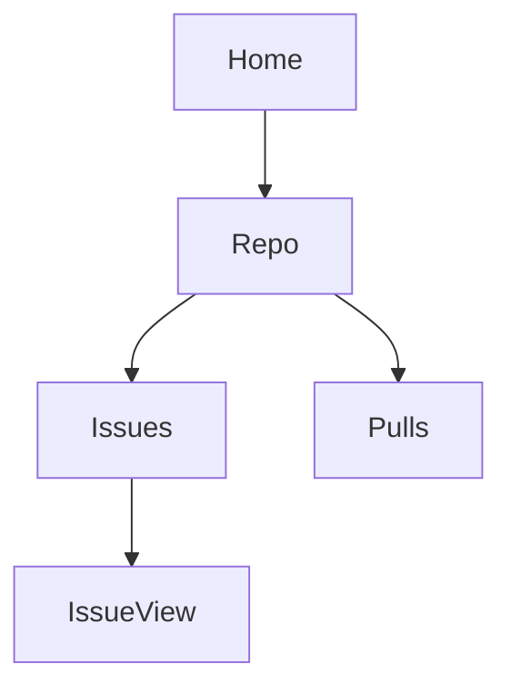

# web2skill (`w2s`)

**Turn any website into a reusable AI agent skill.**

`w2s` is a skill that makes skills. Load it into your AI coding agent (Claude Code, Codex, Cursor, etc.), point it at a website, and it produces a structured folder of `SKILL.md` files that any agent can read to navigate that website like a human would.

```
You:   "Compile github.com for issue management"
Agent: *uses w2s* → produces a github.com skill

You:   "Close issue #42 on foo/bar"
Agent: *reads the github.com skill* → navigates and closes it
```

That's the whole idea.

---

## Table of contents

- [Why this exists](#why-this-exists)
- [Quick start](#quick-start)
- [How it works](#how-it-works)
- [Installation](#installation)
- [Usage](#usage)
- [The skill format](#the-skill-format)
- [Running compiled skills](#running-compiled-skills)
- [Examples](#examples)
- [Project structure](#project-structure)
- [What w2s does NOT do](#what-w2s-does-not-do)
- [Contributing](#contributing)
- [License](#license)

---

## Why this exists

Today, asking an AI agent to do something on a website means the agent has to:

1. Open the website
2. Look at thousands of DOM elements
3. Figure out which one is the right button
4. Click it
5. Repeat for every step

That's slow, expensive (lots of LLM tokens), and flaky (the agent gets confused by noise).

`w2s` flips this. The expensive work — figuring out where everything is on a website — happens **once**, when you compile the site. The result is a folder of `SKILL.md` files: compact, structured instruction manuals the agent reads in seconds. After that, every interaction with that website is fast, cheap, and reliable.

### Who is this for?

- **Anyone** who wants their AI agent to do things on a specific website
- **Developers** building agents that need to interact with web apps
- **Teams** that want consistent, shareable automation across tools and team members

You don't need to write code. You don't need to understand selectors or DOMs. You point, w2s compiles, your agent gets a new skill.

---

## Quick start

The fastest path from zero to a working compiled skill.

### 1. Install w2s into your agent

```bash
git clone https://github.com/rishi-ie/web2skill.git
mkdir -p ~/.claude/skills
cp -r web2skill/w2s ~/.claude/skills/web2skill
```

Restart Claude Code. The `web2skill` skill is now available.

### 2. Compile a website

Ask your agent:

```
Compile https://github.com/foo/bar and https://github.com/foo/bar/issues
into a skill.
```

The agent will visit the URLs, generate the skill, and save it to `~/.claude/skills/github.com/`.

### 3. Use the skill

Either ask your agent:

```
Star the web2skill repo on GitHub.
```

Or run it programmatically with [browser-use](./docs/integrations/browser-use.md):

```python
import asyncio
from pathlib import Path
from browser_use import Agent
from langchain_openai import ChatOpenAI

async def main():
    skill = Path("~/.claude/skills/github.com").expanduser().read_text()
    agent = Agent(
        task="Star the web2skill repo on GitHub",
        llm=ChatOpenAI(model="gpt-4o"),
        extend_system_message=skill,
    )
    result = await agent.run()
    print(result)

asyncio.run(main())
```

A real Chrome window opens and you can watch the agent work.

---

## How it works

`w2s` is itself a skill — a folder of files that an agent loads.

```
w2s/
├── SKILL.md              ← the entry point the agent reads first
├── format-spec.md        ← exact schema for output skills
├── distillation.md       ← how to extract a compact page map
├── route-grouping.md     ← how to group URLs into route families
└── examples/             ← worked examples
    ├── simple-static-site/
    └── complex-spa/
```

When you ask your agent to compile a website, the agent follows a 7-step methodology:

1. **Extract the URL list** — parse the user's request into URLs
2. **Distill each URL** — observe the page in its initial state AND click every interactive element to trigger modals, dropdowns, hover-revealed actions, etc.
3. **Group URLs into route families** — URLs that share a structure share a file
4. **Write one `SKILL.md` per route family** — page architecture, element inventory, workflows, edge cases
5. **Write the `overview.md`** — site map, route index, site-wide patterns
6. **Save the skills** — to the agent's skills directory
7. **Self-check** — verify every ref in workflows exists in the element inventory, every match pattern is real, selectors are stable

The output looks like this:

```
~/.claude/skills/
└── github.com/
    ├── overview.md       ← site map + route index
    ├── repo.md           ← instructions for /:owner/:repo
    ├── issues.md         ← instructions for /:owner/:repo/issues
    └── ...
```

---

## Installation

`w2s` is just a folder of markdown files. There is nothing to install beyond copying them into your agent's skills directory.

### Claude Code

```bash
git clone https://github.com/rishi-ie/web2skill.git
mkdir -p ~/.claude/skills
cp -r web2skill/w2s ~/.claude/skills/web2skill
```

Restart Claude Code. The `web2skill` skill is now available — you should see it listed when you ask Claude what skills it has.

### Codex

Codex CLI looks for skills in `~/.codex/skills/`:

```bash
git clone https://github.com/rishi-ie/web2skill.git
mkdir -p ~/.codex/skills
cp -r web2skill/w2s ~/.codex/skills/web2skill
```

### Cursor

Cursor reads skills from a project-local or global location depending on your setup. Place `w2s/` wherever Cursor expects to find Agent Skills. See [Cursor's skills documentation](https://docs.cursor.com) for the current path.

### Other agents

Any agent that supports the Agent Skills format (YAML frontmatter + markdown body) can use w2s. The skill is intentionally portable. If your agent has a skills directory, copy `w2s/` there.

### Custom location

You can also keep w2s anywhere and point your agent at it. The skill is self-contained — no dependencies, no build step.

---

## Usage

Once installed, just talk to your agent naturally. The w2s skill triggers on phrases like:

- "Compile `https://github.com/foo/bar` into a skill"
- "Use w2s to make a skill for managing Linear issues"
- "Turn `https://app.notion.so` into a skill so I can create pages"
- "w2s `https://example.com/pricing` and `https://example.com/signup`"

### What happens when you ask for a compilation

The agent will:

1. **Confirm the URL list** — if you only gave one URL or a domain, ask you for 2-3 more to identify the route family
2. **Ask about the goal** — what should the agent be able to DO on this site once the skill is ready?
3. **Ask about auth** — will you be logged in when using the skill? Auth walls change the available features.
4. **Visit each URL and compile** — this takes 1-3 minutes per URL
5. **Save the skill** to the agent's skills directory
6. **Tell you the skill is ready** and how to use it

### After compilation

You can use the compiled skill in two ways:

**1. Through your agent** (easiest):

```
Star the web2skill repo on GitHub.
```

The agent reads the github.com skill, follows the workflow, and does the action. The user sees the browser window if they're using a visible browser tool.

**2. Programmatically with browser-use** (most flexible):

See the [browser-use integration guide](./docs/integrations/browser-use.md) for the full guide. Works for any agent that accepts a system prompt.

---

## The skill format

Every skill that w2s produces follows the same structure. This is what makes skills **portable across agents** — any agent that can read markdown with YAML frontmatter can use them.

### Output structure

```
<skills-dir>/<domain>/
├── overview.md        # site map + route index
├── <route-1>.md       # per-route skill
├── <route-2>.md
└── ...
```

### `overview.md` — the site map

```markdown
---
name: github
domain: github.com
description: |
  Use github.com to navigate repositories, manage issues and PRs,
  star/watch repos, and configure settings.
match:
  - github.com
  - github.com/*
---

# GitHub — Site Map

## Route map


## Sub-skills
- `repo.md` — matches /:owner/:repo
- `issues.md` — matches /:owner/:repo/issues/*
- `pulls.md` — matches /:owner/:repo/pull/*

## Site-wide patterns
- Header: logo top-left, search top-center, avatar top-right
- Auth: "Sign in" link at top-right when logged out
```

### `SKILL.md` (per route) — a single page

```markdown
---
name: github-issues
description: |
  Read, filter, create, and close issues on a GitHub repository.
match:
  - /^https:\/\/github\.com\/[^/]+\/[^/]+\/issues(\/.*)?$/
requires:
  - github
---

# GitHub — Issues Page

## Page architecture
- Sub-header: repo name + Issues/Pull requests toggle
- Left rail: filters (Open/Closed, Labels, Milestones, Assignees)
- Main column: list of issues

## Element inventory

### `new-issue-btn`
- type: button
- selector: `a[href$="/issues/new"]`
- fallback: text="New issue"
- location: top-right of main column, green

### `issue-row` (repeatable)
- type: list item
- selector: `[data-testid="issue-row"]`
- contains:
  - `issue-title` (link)
  - `issue-number` (text, e.g. "#1234")
  - `issue-labels` (list)

## Workflows

### Create a new issue
1. Confirm on route /owner/repo/issues
2. Click `new-issue-btn`
3. Fill in title (input labeled "Title")
4. Fill in body (textarea labeled "Leave a comment")
5. Click "Submit new issue"

## Edge cases
- Empty state: "No issues" with "New issue" CTA
- Auth wall: "Sign in" link at top-right when logged out
```

For the full schema — every required field, every section, every validation rule — see [`w2s/format-spec.md`](./w2s/format-spec.md).

For the full methodology — how the agent should distill, group, and document — see [`w2s/SKILL.md`](./w2s/SKILL.md) (the w2s entry point).

---

## Running compiled skills

Compiling a skill produces a folder of markdown. To actually **run** it (have an agent follow the workflows against a live browser), you need a browser-use client. The recommended one is [**browser-use**](https://github.com/browser-use/browser-use) — open source, Python, headed mode by default, supports a custom system prompt.

A w2s skill is just markdown with YAML frontmatter. browser-use accepts a custom system prompt. You read the skill, pass it as the system prompt, the agent uses it. That's the whole integration.

**The minimum:**

```python
import asyncio
from pathlib import Path
from browser_use import Agent
from langchain_openai import ChatOpenAI

async def main():
    skill = Path("~/.claude/skills/github.com").expanduser().read_text()
    agent = Agent(
        task="Star the web2skill repo on GitHub",
        llm=ChatOpenAI(model="gpt-4o"),
        extend_system_message=skill,
    )
    result = await agent.run()
    print(result)

asyncio.run(main())
```

You will see Chrome open and watch the agent navigate using the skill.

**Full guide:** [`docs/integrations/browser-use.md`](./docs/integrations/browser-use.md) — covers installation, a `load_skill()` helper that picks the right `SKILL.md` for the task, headed vs headless mode, multi-skill tasks, and gotchas.

**Other integrations** are also possible (Stagehand, raw Playwright, Anthropic Computer Use) — w2s skills are just markdown, so any agent that can read a system prompt can use them.

---

## Examples

Two fully worked end-to-end examples are in [`w2s/examples/`](./w2s/examples/):

### [`w2s/examples/simple-static-site/`](./w2s/examples/simple-static-site/)

A 4-route marketing site (home, pricing, signup, login). Shows the simplest case: static HTML, semantic markup, no auth. Read this first.

### [`w2s/examples/complex-spa/`](./w2s/examples/complex-spa/)

A fictional project management tool (login, signup, dashboard, inbox, team view, issue detail, new-issue modal, settings). Shows the realistic case: SPA, client-side routing, modals that don't refresh the page, infinite scroll, dynamic content, auth walls. Read this second.

Each example folder contains a `README.md` that walks through the user's request, the URLs compiled, the grouping decision, and the output files.

---

## Project structure

```
web2skill/
├── README.md                       ← you are here
├── w2s/                            ← the w2s skill (load this into your agent)
│   ├── SKILL.md                    ← entry point, the 7-step methodology
│   ├── format-spec.md              ← exact schema for output SKILL.md files
│   ├── distillation.md             ← how to extract a compact page map
│   ├── route-grouping.md           ← how to group URLs into route families
│   └── examples/
│       ├── simple-static-site/     ← 4-route worked example
│       └── complex-spa/            ← 8-route worked example
└── docs/
    └── integrations/
        └── browser-use.md          ← how to use compiled skills with browser-use
```

---

## What w2s does NOT do

Be honest about scope. w2s does not:

- **Self-heal broken skills.** If a site changes after compilation, workflows may fail. Re-run w2s to refresh. (A self-healing loop is on the roadmap.)
- **Compile behind authentication automatically.** You need to be logged in during compilation. The agent cannot log in for you (no password to use).
- **Handle every edge case of every site.** w2s works best on sites with stable, semantic HTML and `data-testid` attributes. Heavily SPAs with auto-generated class names produce weaker skills.
- **Replace a domain expert.** A compiled skill captures the structure of a site. It does not capture institutional knowledge ("we never close issues on Fridays because of deploy windows").
- **Run anywhere by itself.** w2s is the recipe. You need an agent to execute the recipe (Claude Code, Codex) and a browser-use client to run the output (browser-use, Playwright, etc.).

---

## Contributing

The most valuable contributions are **skills for useful sites**. If you compile a skill for a site others would benefit from, open a PR adding it under `w2s/examples/your-site/`.

Other ways to contribute:

- **Improve the format spec** — if a section is unclear or missing, edit `w2s/format-spec.md` and open a PR
- **Improve the methodology** — if the 7-step process has a gap, edit `w2s/SKILL.md`
- **Add integration guides** — `docs/integrations/` is the place for guides on using w2s skills with other browser agents
- **Report a site that doesn't compile** — open an issue with the URL and what went wrong

---

## License

MIT. See [`LICENSE`](./LICENSE).
